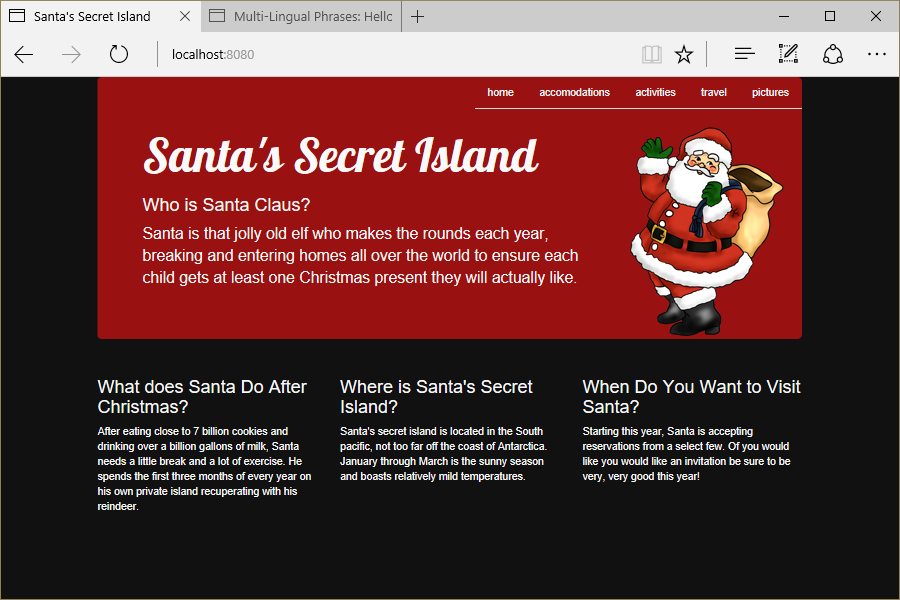

# Santa's Secret Island
Version 0.3.0: July 12, 2016
by [Karen Freeman-Smith](https://karenfreemansmith.github.io)

### Technologies Used
HTML, CSS/Sass, Bootstrap, Angular.js, Node.js, Gulp, Git, Github

## Description
[Learn How to Program](http://learnhowtoprogram.com) Intro to Programming Week 1 Individual Project: Build a website for a private resort to learn fundamentals of HTML and CSS.

* Version 0.2.0 Added npm & gulp tools for Sass and development server
* Version 0.3.0 Refactored into Angular.js Single Page App

## Setup/Installation
* [View on Github Pages](https://karenfreemansmith.github.io/LHP-IntroWk1-PrivateResort)

 __OR__
* Clone project to your computer
* run "npm install"
* run "http-server"
* Navigate to "localhost:8080"

## Support & Contact
For questions, concerns, or suggestions please email karenfreemansmith@gmail.com

## Known Issues
* None

## Legal
* Licensed under the GNU General Public License v3.0

Copyright (c) 2016 Copyright _[Karen Freeman-Smith](https://karenfreemansmith.github.io)_ All Rights Reserved.
